 

<h1 align="center"> Командный дипломный проект по курсу Python Django </h1>
<h2 align="center">Проект сайта интернет-магазина MEGANO</h2><h5 align="center">Период работы над проектом 29 апреля 2023 - 24 июля 2023</h5>
<h3>Участники Проекта: </h3> 
<h4>TeamLead: Максим Семенюк </h4>
<h4> Татьяна Федутик </h4>
<h4> Владимир Игнатушенко </h4>
<h4> Александр Белов </h4>
<h4> Александр Малафеевский </h4>

 

<h1>Добро пожаловать в MEGANO !</h1> 

> <h2> Структура сайта: </h2>
> 
 Главная страница

> 
 Каталог (сам каталог, детальная страница товара)

> 
 Скидки 

> 
 Сравнение 

> 
 Страница оформления заказа (корзина, оформление заказа, оплата)

> 
 Личный кабинет (личный кабинет, профиль, история заказов)

> 
 Административный раздел

> <h2> Главная страница </h2>
>
> 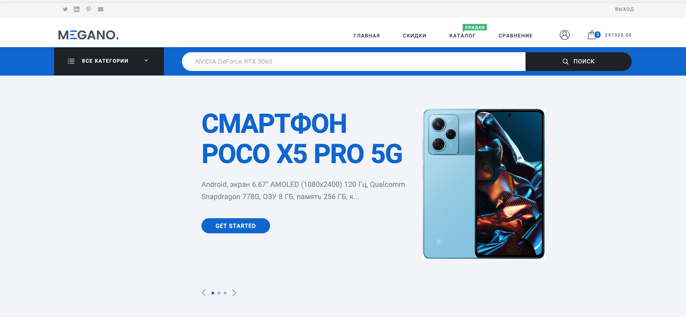
> 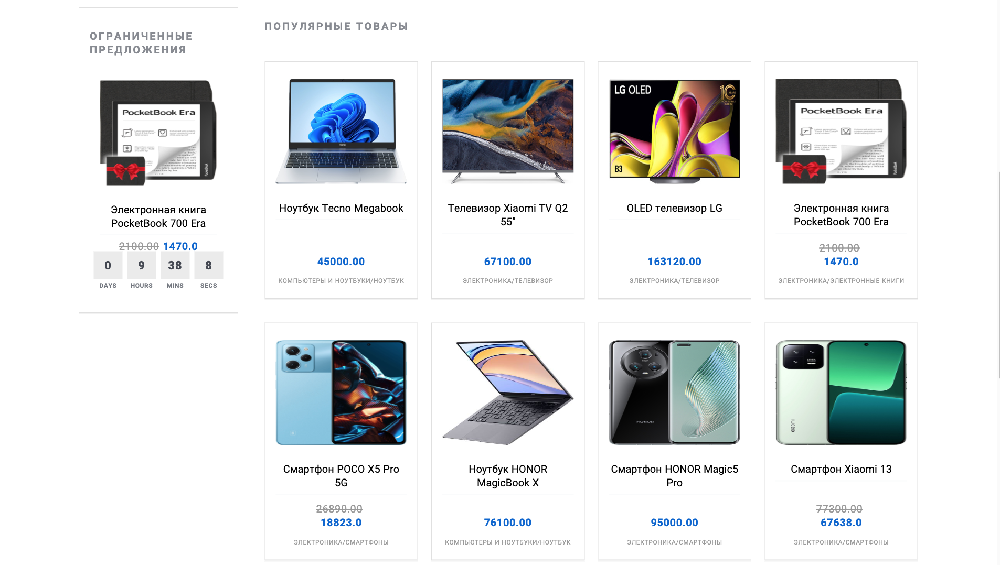
> 

> <h2> Каталог </h2>
> <h3> Каталог </h3>
>
> 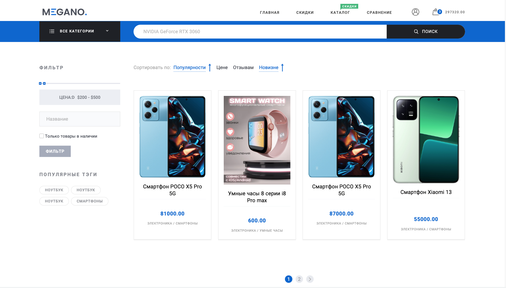
> 
> <h3> Детальная страница товара </h3>
>
> 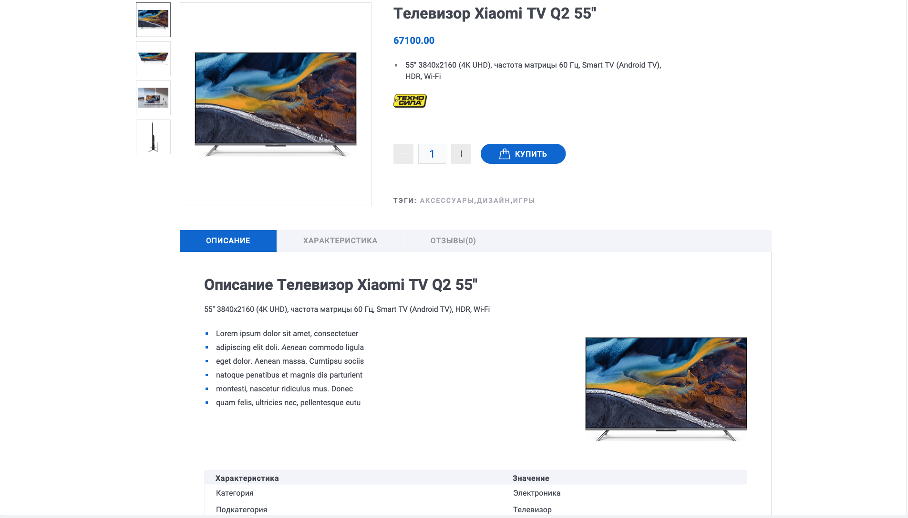

> <h2> Скидки </h2>
>
> 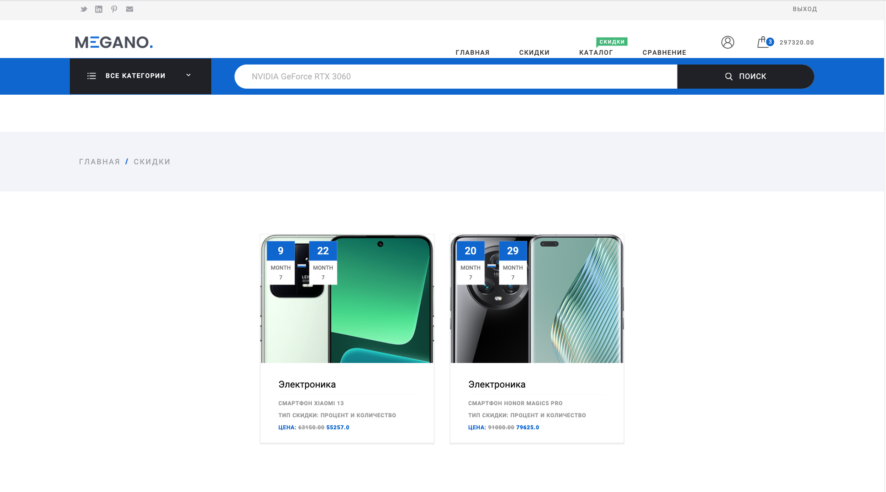

> <h2> Сравнение </h2>
>
> 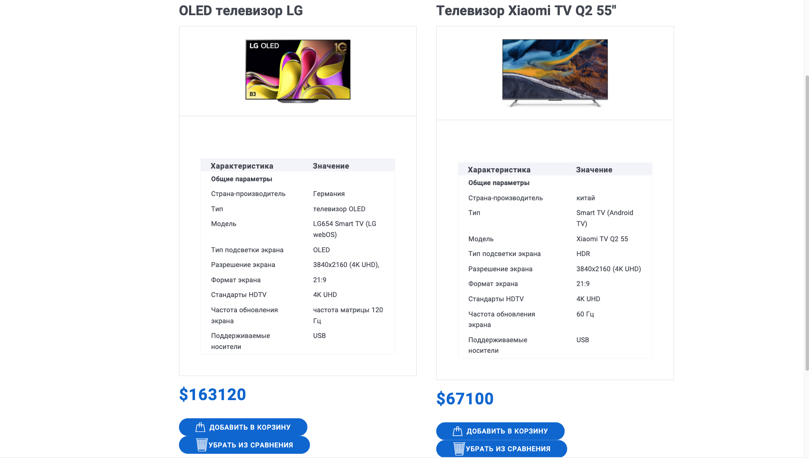

> <h2> Оформление заказа </h2>
> <h3> Корзина </h3>
>
> 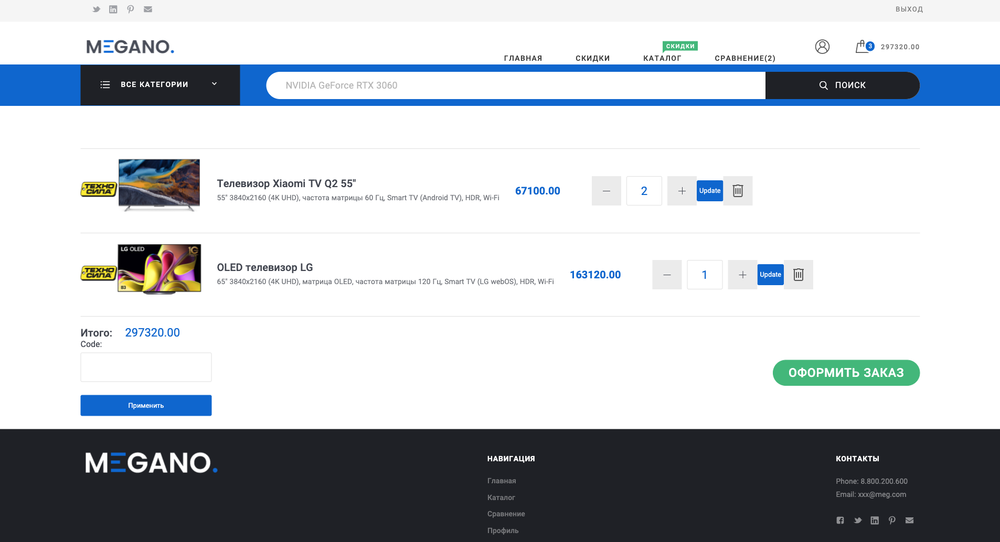
> <h3> Оформление Шаг 1 </h3>
>
> 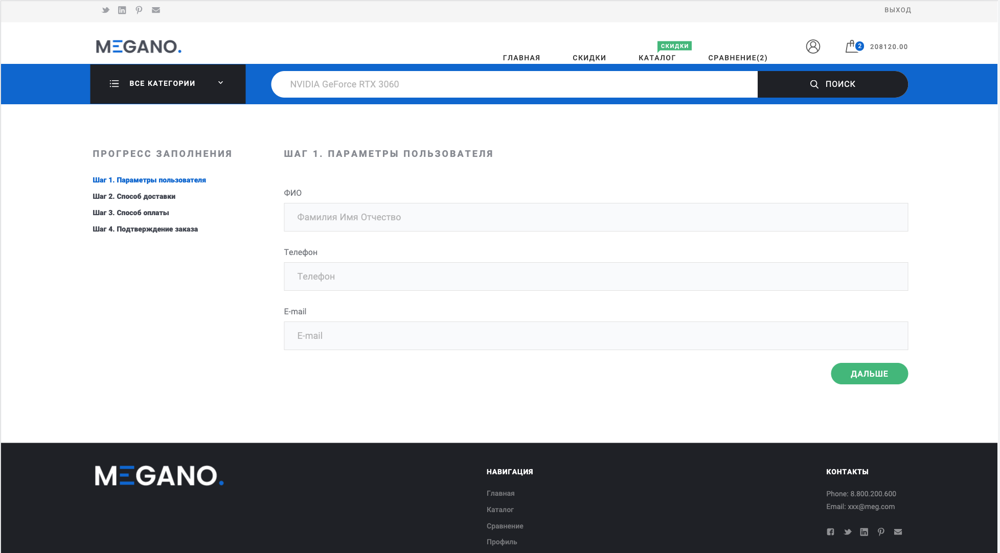
> <h3> Оформление Шаг 2 </h3>
>
> 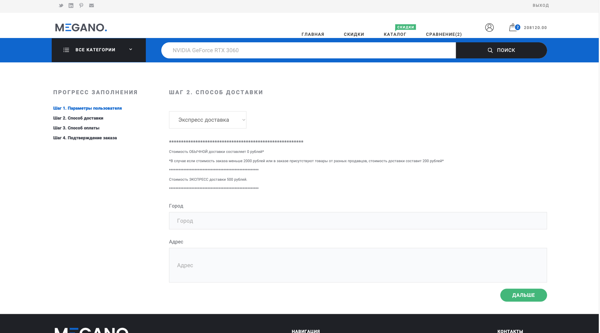
> <h3> Оформление Шаг 3 </h3>
>
> 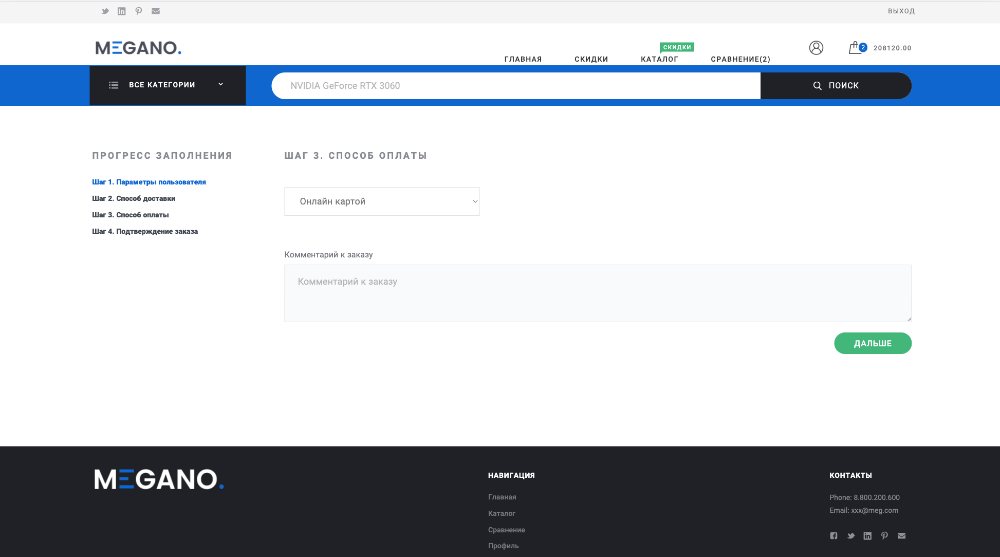
> <h3> Оформление Шаг 4 </h3>
>
> 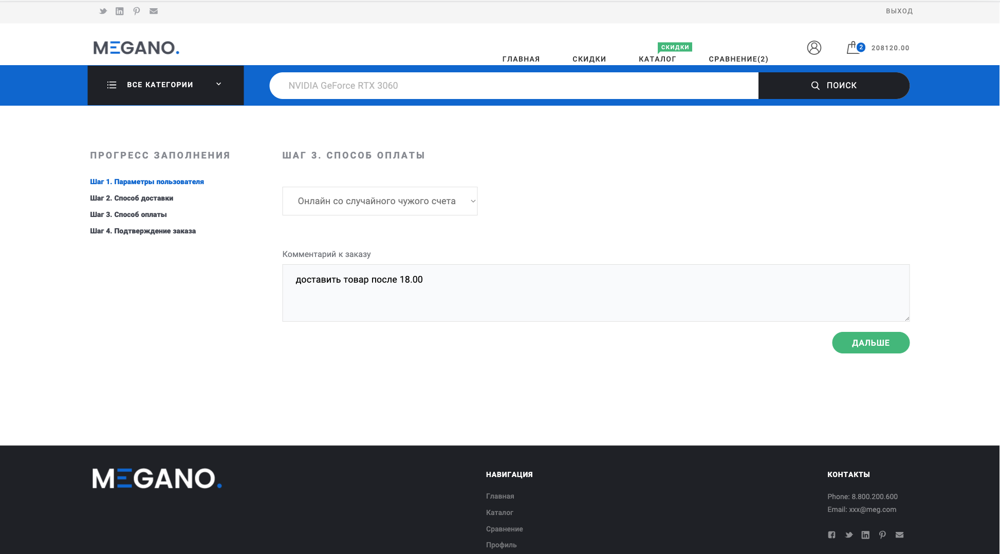
> <h3> Предварительный просмотр и подтверждение </h3>
>
> 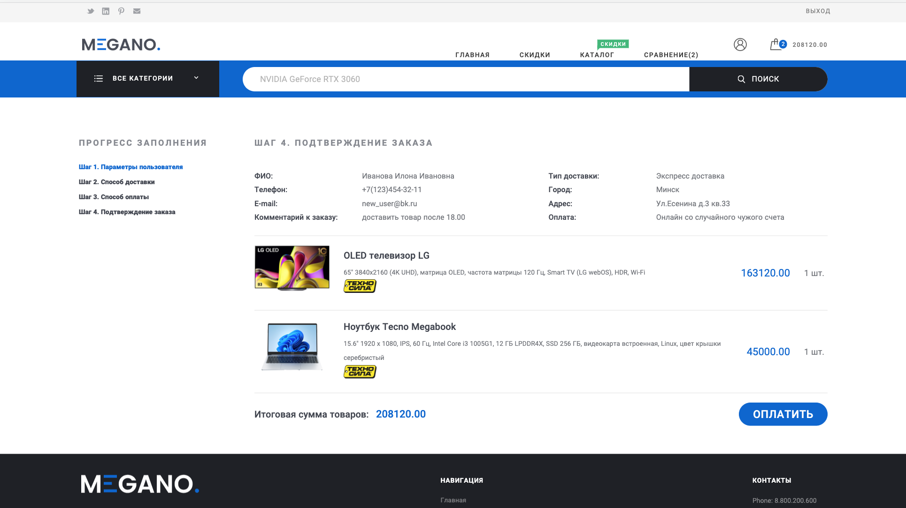
> <h3> Оплата Способ 1 - Онлайн картой </h3>
>
> 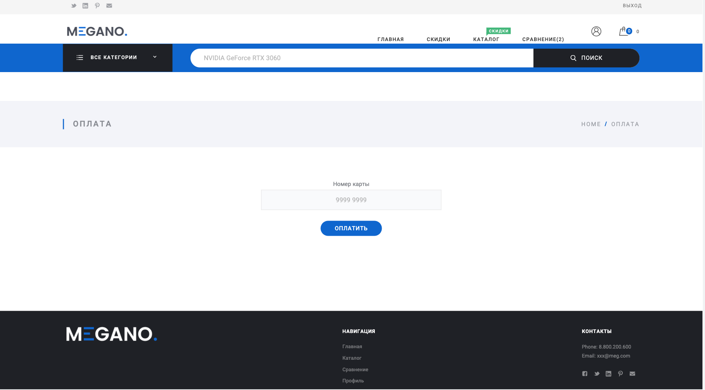
> <h3> Оплата Способ 2 - Онлайн со случайного чужого счета </h3>
>
> 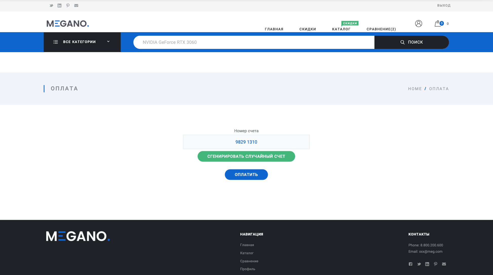
 

> <h2> Личный кабинет </h2>
> <h3> Личный кабинет </h3>
>
> 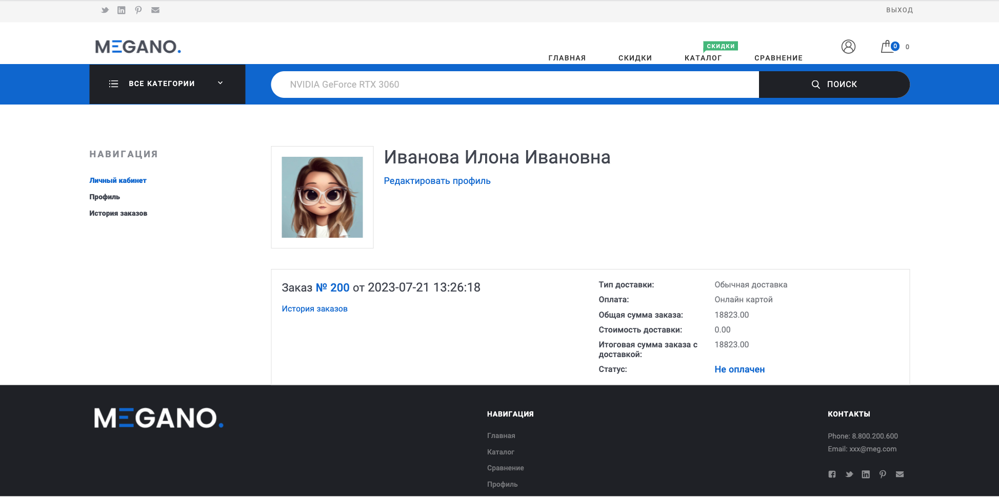
> 
> <h3> Профиль </h3>
>
> 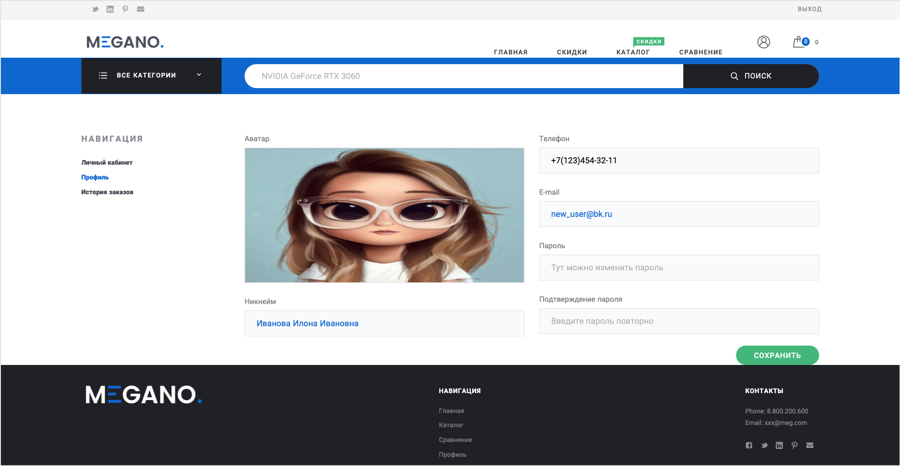
> 
> <h3> История заказов </h3>
>
> 

> <h3> Регистрация нового пользователя </h3>
>
> 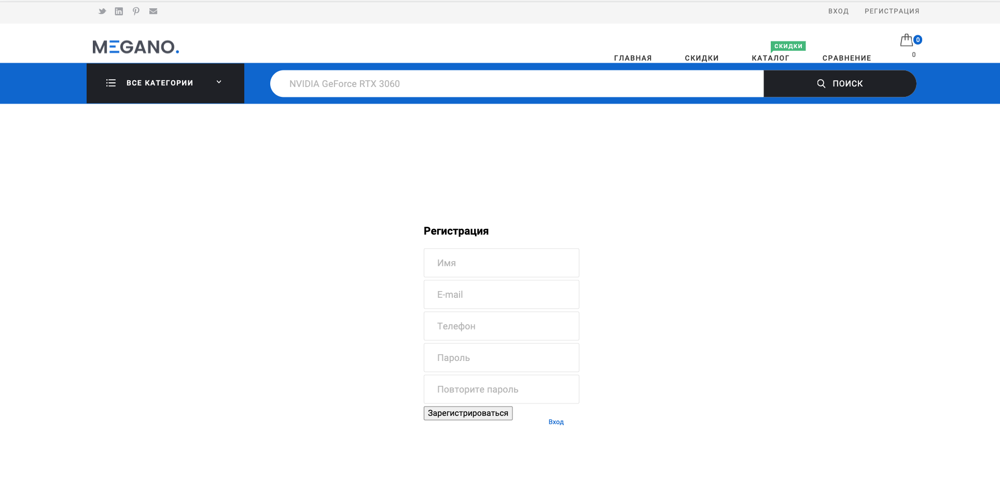
> 
> 
> <h3> Вход в личный кабинет </h3>
>
> 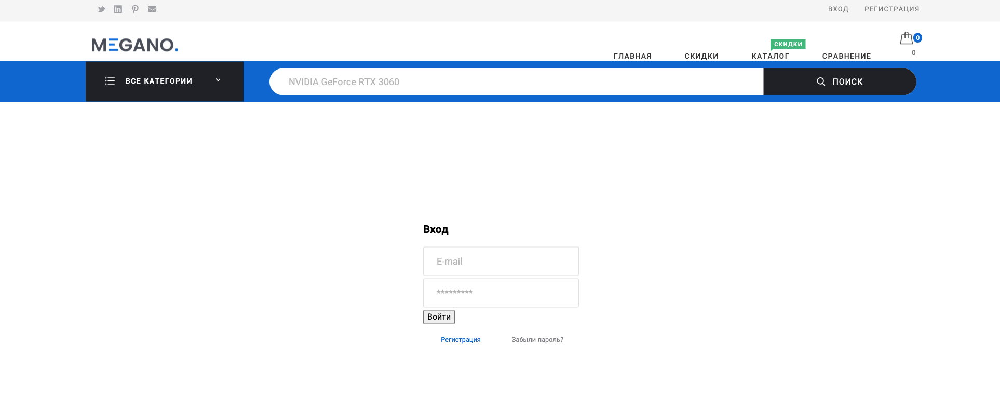
> 
> 
> <h3> Восстановление пароля </h3>
>
> 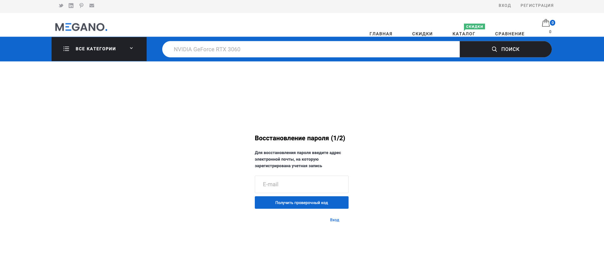

> <h2> Пошаговый запуск проекта локально: </h2>
>
> <h3> Активируем виртуальное окружение </h3> 
>
>> 
<i> source venv/bin/activate </i>
 
> <h3> Устанавливаем пакеты </h3>  
>
>> 
<i> pip install -r requirements.txt </i>
 
> <h3> Запускаем базу данных </h3> 
> 
>> 
<i> python manage.py makemigrations </i>
 
>> 
<i> python manage.py migrate </i>
 
> <h3> Запускаем фикстуры </h3> 
> 
>> 
<i> python manage.py loaddata fixtures/1_Setting.json </i>

>> 
<i> python manage.py loaddata fixtures/2_User.json </i>

>> 
<i> python manage.py loaddata fixtures/3_Category.json </i>

>> 
<i> python manage.py loaddata fixtures/4_SubCategory.json </i>

>> 
<i> python manage.py loaddata fixtures/5_Shop.json </i>

>> 
<i> python manage.py loaddata fixtures/6_Product.json </i>

>> 
<i> python manage.py loaddata fixtures/7_ProductInShop.json </i>

>> 
<i> python manage.py loaddata fixtures/8_ProductInShopImage.json </i>

>> 
<i> python manage.py loaddata fixtures/9_Specifications.json </i>

>> 
<i> python manage.py loaddata fixtures/10_Subspecifications.json </i>

>> 
<i> python manage.py loaddata fixtures/11_Discount.json </i>

>
> <h3> Запуск сельдерей для проведения оплаты </h3> 
>
>> 
<i> celery -A config  worker -l info -P eventlet </i>

>> 
<i> celery worker --app=config --loglevel=info </i>

>> 
<i> docker-compose up --build -d </i>

>
>
>> <h3> Для Mac Загрузка сельдерей </h3>
>>  
<i>1. brew install rabbitmq </i>

>>  
<i>2. export PATH=$PATH:/usr/local/sbin </i>

>> 
>> <h3>Start server (Mac) </h3>
>> 
<i>3. sudo rabbitmq-server -detached  
(-detached указывает, что сервер должен работать в фоновом режиме) 
  </i>

>> 
<i>4. Переходим по http://localhost:15672 вводим логин и пароль </i>

>> 
<i>5. Username: guest </i>

>> 
<i>6. Password: guest </i>

>>
>> <h3>To stop server </h3>
>> 
<i>7. sudo rabbitmqctl stop </i>

>> 
>> <h3>Еще 1 вариант, если с предыдущими не получилось </h3>
>> 
<i> 1. brew install rabbitmq </i>

>> 
<i> 2. export PATH=$PATH:/usr/local/sbin </i>

>> 
<i> 3. rabbitmq-server  </i>

>> 
<i> 4. python manage.py runserver </i>

>> 
<i> 5. Переходим по http://localhost:15672 вводим логин и пароль </i>

>> 
<i> 6. Username: guest  </i>

>> 
<i> 7. Password: guest  </i>

>>
>
> <h3> Запускаем проект </h3>
>
>> 
<i> python manage.py runserver </i>

>
> <h2> Пошаговый запуск проекта в Docker: </h2>
>
>> <h3>Устанавливаем Docker на рабочий стол </h3>
>>
>>> 
<i> скачать можно тут: https://www.docker.com/ </i>

>> <h3>Запускаем в терминале </h3> 
>>
>>> 
<i> docker-compose up --build </i>

>>> 
 или 

>>> 
<i> docker-compose up --build -d (с возможностью закрывать терминал) </i>

